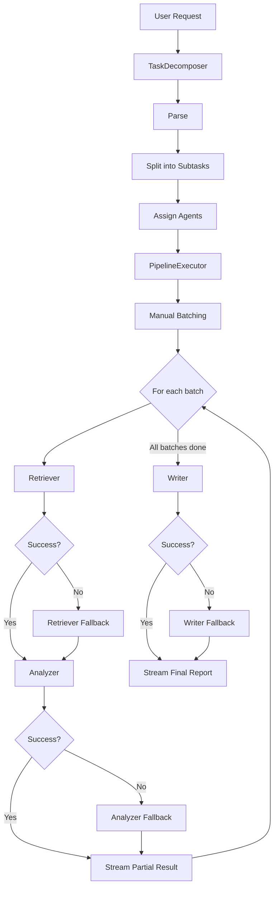
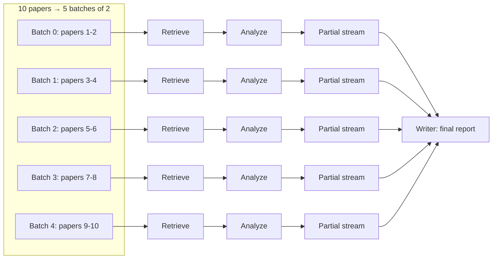
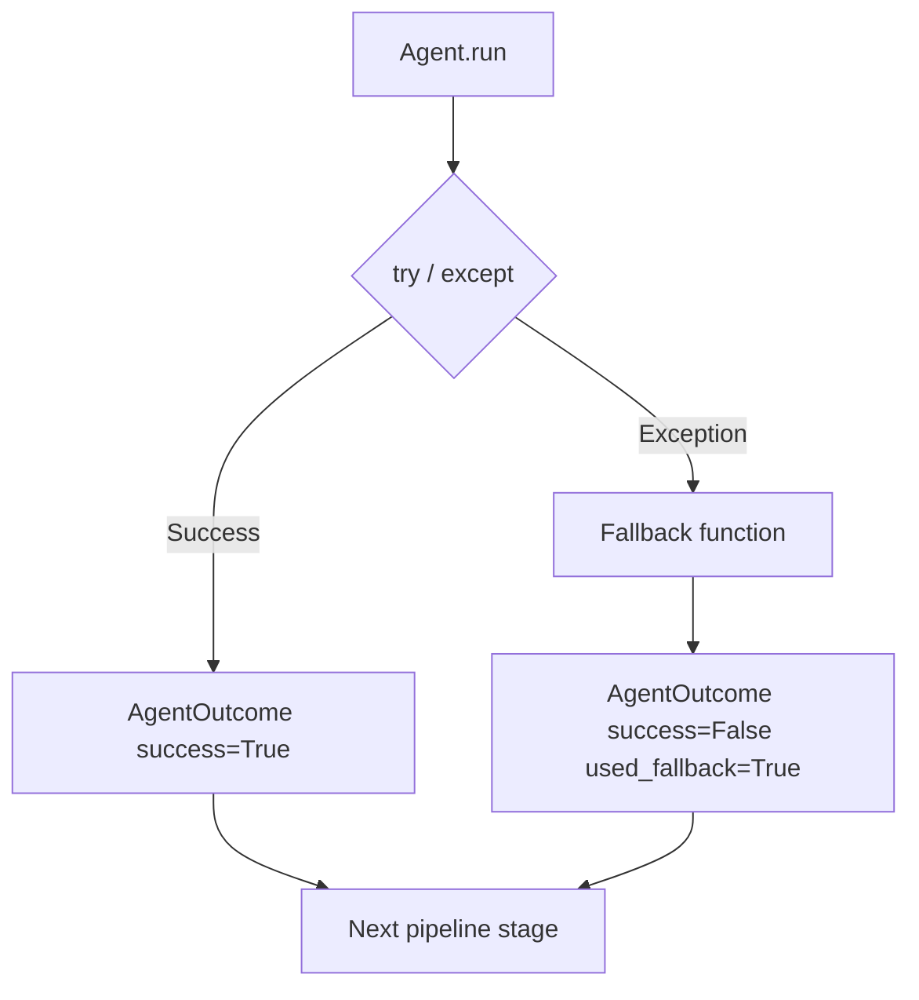
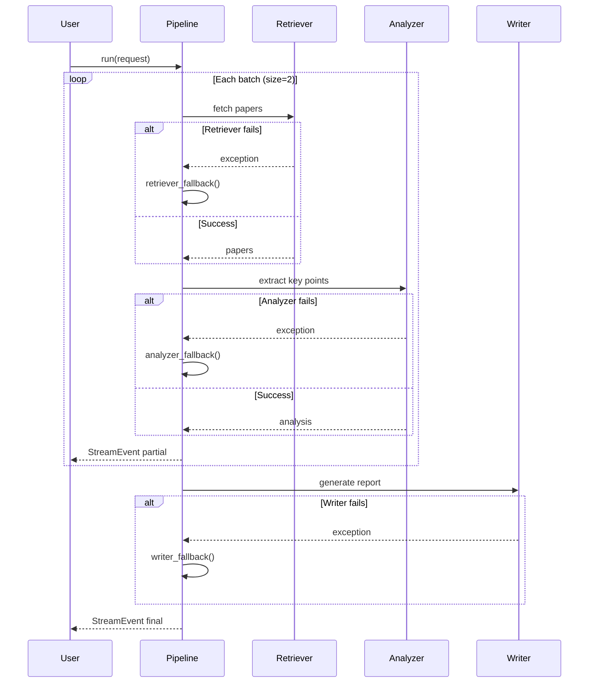

# Agent Pipeline Design

This document describes how the system executes decomposed tasks with **manual batching**, **streaming partial results**, and **failure handling** so a single agent failure does not break the pipeline.

## Package layout

```
src/
├── decomposer/          # Parse → Split → Assign
├── agents/              # Retriever, Analyzer, Writer implementations
│   ├── base.py
│   ├── retriever.py
│   ├── analyzer.py
│   ├── writer.py
│   └── registry.py
└── pipeline/            # Execution, batching, failure handling
    ├── models.py
    ├── batching.py
    ├── failure.py
    ├── executor.py
    └── pipeline.py
```

## End-to-end flow



## Manual batching

Large fetch tasks are split into fixed-size batches instead of processing all items at once.

Example request: **"Fetch 10 papers, extract key points, and generate a report."**

With `batch_size=2`:



Implementation: `pipeline/batching.py`

| Function | Purpose |
|----------|---------|
| `parse_fetch_count(description)` | Reads `"10 papers"` from the retriever step |
| `manual_batches(total, batch_size)` | Returns `[[1,2], [3,4], ...]` — no external batching library |

## Failure handling

Each agent runs inside `run_agent_safe()` in `pipeline/failure.py`. Exceptions are caught, a fallback output is produced, and execution continues.



| Agent | Fallback behavior |
|-------|-------------------|
| **Retriever** | Returns cached paper metadata for the batch |
| **Analyzer** | Returns minimal key points noting the failure |
| **Writer** | Returns a partial report with collected analysis |

The pipeline never raises an unhandled agent exception to the caller. Failures are surfaced as `StreamEvent` objects with `event_type=BATCH_FAILED` or `PIPELINE_FAILED` and `recovered=True`.

## Streaming events

`PipelineExecutor.run()` is an async generator yielding `StreamEvent` objects:

| Event type | When emitted |
|------------|--------------|
| `batch_start` | Before each batch begins |
| `partial` | After retrieve + analyze succeed for a batch |
| `batch_failed` | Agent failed but fallback recovered the batch |
| `pipeline_failed` | Writer failed; partial report returned |
| `final` | Pipeline complete |



## Key modules

### `pipeline/batching.py`
- Parses item count from retriever descriptions
- Builds explicit batch lists (manual, no black-box abstraction)

### `pipeline/failure.py`
- `run_agent_safe()` — try/except wrapper for every agent call
- `retriever_fallback()`, `analyzer_fallback()`, `writer_fallback()` — deterministic recovery paths

### `pipeline/executor.py`
- Orchestrates batch loop: retrieve → analyze → stream
- Aggregates analyzed items across batches
- Runs writer once at the end

### `pipeline/pipeline.py`
- `AgentPipeline` — combines `TaskDecomposer` + `PipelineExecutor`

## Usage

```python
import asyncio
from pipeline import AgentPipeline

async def main():
    pipeline = AgentPipeline(
        batch_size=2,
        retriever_fail_batches={1},  # simulate failure on batch 1 (papers 3-4)
    )

    async for event in pipeline.run(
        "Fetch 10 papers, extract key points, and generate a report."
    ):
        print(event.event_type.value, event.message)

asyncio.run(main())
```

Run the demo:

```powershell
cd src
python run_pipeline.py
```

## Design trade-offs

1. **Sequential batches vs parallel** — Batches run one at a time to keep manual batching explicit and easy to trace. Parallel batch execution can be added later without changing agent interfaces.

2. **Fallback quality vs availability** — Fallbacks return structurally valid but lower-quality data so the pipeline completes. Production systems might add retry logic before falling back.

3. **Single writer at end vs per-batch writes** — One final write step produces a coherent report. Partial streams still expose batch-level progress to the user.
